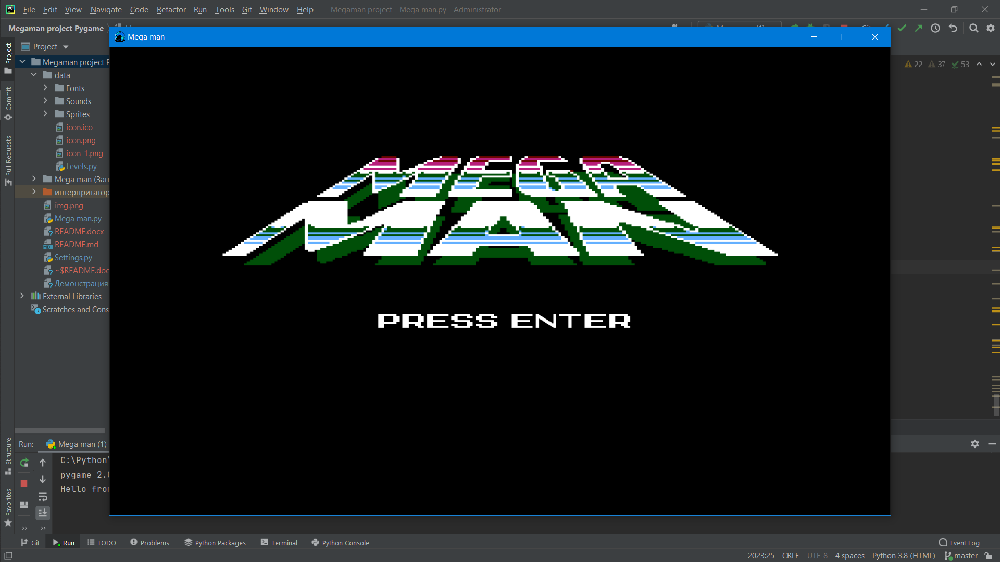
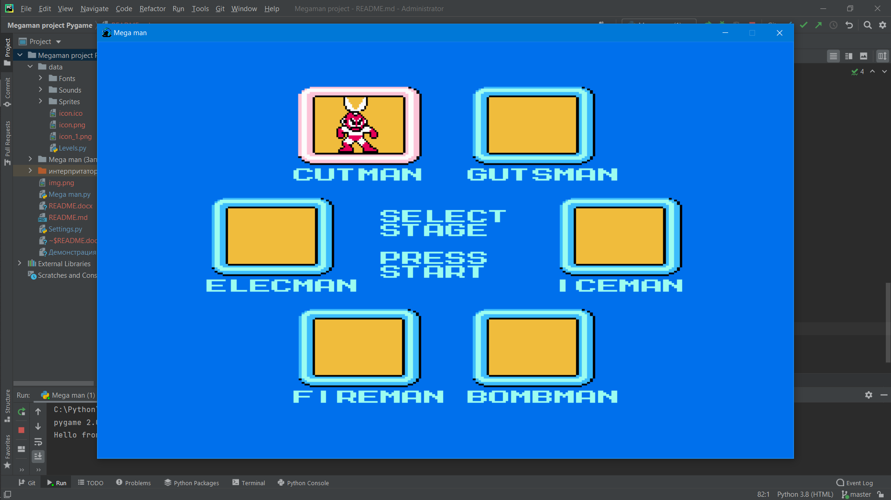
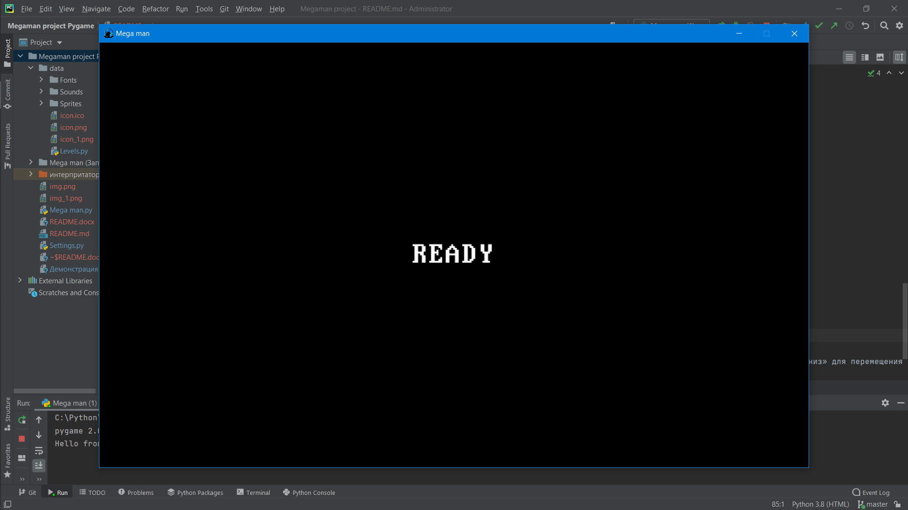
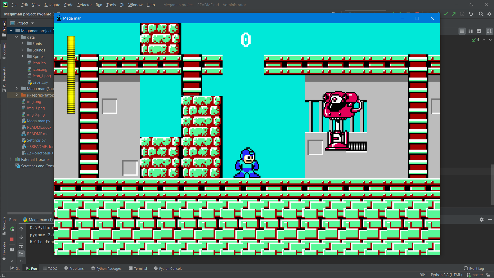
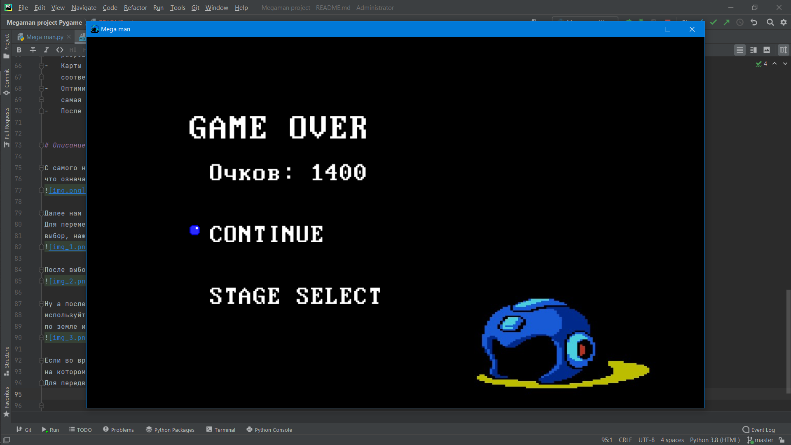
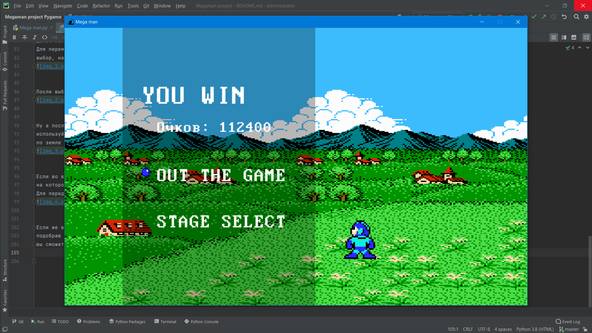
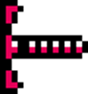
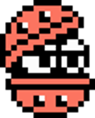
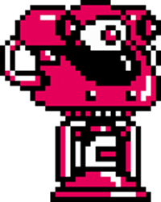
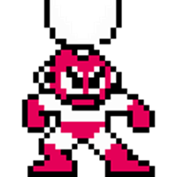

# Проект «Mega man»

---

## Описание идеи
Нашим главным заданием было создание собственной игры с помощью библиотеки PyGame.
При этом нас не ограничили ни в жанре, ни даже в самой концепции игры. Поэтому я решил выбрать довольно
популярный жанр видеоигр, который называется «платформер». В данном жанре самыми главными элементами геймплея
являются прыжки по платформам, лазание по лестницам, а так же подбирание специальных предметов, которые могут либо 
помочь пройти тот или иной уровень, либо же, наоборот, усложнить игроку жизнь.  Одними из самых ярких и запоминающихся
представителей этого жанра являются игры про Марио или синего ежа Соника. Однако в качестве образца мною была выбрана
другая довольно популярная в период девяностых годов двадцатого века игра под названием «Mega Man». Именно её мне
и захотелось написать.

## Структура проекта

- Папки
    -   data – папка для хранения шрифтов, звуковых эффектов, изображений и уровней.
    -   Mega man (Запуск) — проект, измененный с помощью библиотеки PyInstaller, 
        для возможности запустить проект на любом компьютере.
- Файлы
    -   Mega man.py – главный исполняемый файл.
    -   Settings.py – файл с основными настройками.
    -   requirements.txt – файл со списком библиотек, необходимых для запуска проекта в среде программирования, 
        например, в PyCharm.
      

## Структура главного файла

- Классы:
    -	Player – главного героя.
    -	Platform, Spike, Stair, BossGate – платформ, с которыми взаимодействует главный герой.
    -	Blaster, OctopusBattery, Mambu, BigEye – мобов (рядовых врагов).
    -	CutMan – единственного на данный момент босса.
    -	HealBar – показателей жизненной энергии главного героя и боссов.
    -	Camera – камеры, которая всегда пытается держать главного героя в середине экрана,
        за исключением тех случаев, когда игрок находится в самых крайних левой, правой и нижней точках карты.
    -	RollingCutter – ножниц-бумеранга, которыми пользуется босс.
    -	BonusBall, MegaBall, HealCupsule – предметов, которыми может взаимодействовать главный герой,
        выпадающие с врагов при их уничтожении.
    -	Bullet, EnemyBullet – пуль главного героя и вражеских пуль, соответственно.
- Функции:
    -   make_level - для загрузки уровня и внесения спрайтов в группы.
    -   start_screen - для показа стартового экрана.
    -   stage_select - для выбора уровня.
    -   continue_menu - для показа «экрана смерти».
    -   victory_screen для показа победного экрана.
    -   ready - для показа надписи "READY" перед началом прохождения уровня.
    -   print_score - для вывода на экран текущего количества очков.
    -   new_game - для запуска выбранного уровня.

## Запуск проекта

Для запуска проекта на компьютере, на котором нет среды разработки, вам нужно перейти в папку «Mega man (Запуск)»

## Интересные приёмы:

-	После получения повреждения, главный персонаж становится неуязвимым на короткий промежуток времени.
-	У каждого рядового врага есть точка спавна и если она будет находиться вне поля зрения игрока,
    то враг возродится или просто вернётся в исходную позицию.
-	После победы над боссом камера перестанет держать игрока в центре экрана.
-	Для удобства, все изображения, звуковые эффекты и музыка заранее загружаются в отдельном файле «Settings» 
    для дальнейшего использования. Так же в данном файле хранятся все основные настройки программы, например,
    разрешение экрана, количество кадров в секунду и т. д.
-	Карты уровней хранятся в отдельном файле «Levels» и представляют собой списки строк, каждый элемент которой
    соответствует определённому объекту.
-	Оптимизационный ход: для уменьшения нагрузки на железо, на экране рисуются лишь те объекты, 
    самая малая часть которых попадает в диапазон камеры.
-	После загрузки уровня из отдельного файла «Levels», программа от него больше не зависит.

## Описание работы программы

С самого начала работы программы нас будет встречать титульный экран, на котором будет мигать надпись «Press enter»,
что означает надобность нажатия кнопки «Enter» для продолжения. 

Далее нам покажется экран выбора уровня. Но пока что доступен лишь один из шести возможных уровней. 
Для перемещения курсора в меню выбора уровня используйте клавиши «влево» и «вправо». Чтобы совершить 
выбор, нажмите на клавишу «Enter».

После выбора уровня и экрана представления босса, мы увидим экран подготовки к уровню. 

Ну а после этого начнётся сам игровой процесс. Чтобы управлять персонажем, 
используйте клавиши «влево», «вправо», «вверх», «вниз» для перемещения персонажа 
по земле и лестницам и клавиши «z» и «a» для совершения прыжков и выстрелов соответственно.

Если во время прохождения жизненные силы вашего персонажа иссякнут, то всплывёт соответствующий экран, 
на котором перед вами встанет выбор: вернуться в меню выбора уровня или начать заново прохождение текущего уровня. 
Для передвижения курсора и выбора действия используйте клавиши «вниз», «вверх» и «Enter».

Если же вам удастся победить босса, то с него выпадет специальный предмет, 
подобрав который вы пройдёте уровень. После прохождения уровня всплывет надлежащий экран, на котором 
вы сможете либо выйти из игры, либо вернуться в меню выбора уровня.

## Описание врагов

Рядовые враги:

- Blaster – настенный бластер, стреляющий в 4 разных направлениях и неуязвимый для атаки,
  если его пушка спрятана в специальную броню. 
  
  
  
- Mambu – как и Blaster, неуязвим, если его главные компоненты прикрыты прочной броней. 
  Однако, данный враг может перемещаться по вертикали и стреляет в целых 8 направлениях. 
  Если его место спавна находится в поле зрения игрока, то он даже не появится, но стоит игроку 
  потерять его из виду, он тут же начнёт действовать.
  
  

- Big Eye – большой робот, имеющий всего лишь один глаз. Впрочем, это не мешает ему прыгать и давить своих врагов. 
  А большой запас прочности только помогает ему в этом.
  
  

- Octopus Battery – робот-присоска, постоянно кочующий от стены до стены. 
  Представители данного вида роботов не так уж и опасны, но не стоит их недооценивать, 
  ведь собравшись в большую группу, они могут доставить кучу неприятностей.
  
  

Боссы:

- Cut Man – единственный доступный босс в игре. Его главной особенностью является ножницы-бумеранг, 
  приделанный к его голове и который он может бросить в игрока, но тот, как можно догадаться из названия, 
  вернётся к нему при любом раскладе.
  
  